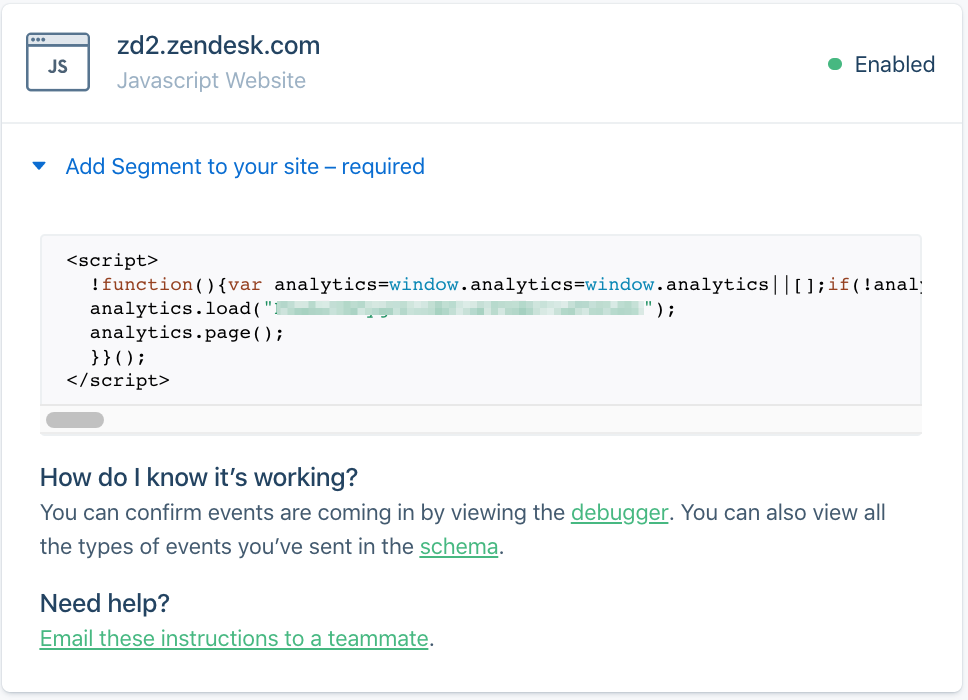

When properly integrated into your customer support knowledge base, Segment can provide some incredible insight into your customers' self service experience. Let's integrate Segment with Zendesk Guide—it only takes a few minutes.

<!-- end -->

---
An integration with [Segment](https://www.segment.com/) involves throwing a couple snippets of javascript into your Zendesk Guide template. It's straigt forward, but let's take it step by step. 

##Step 1 - Obtain Segment Snippet
If you haven't, [create a Segment account](https://app.segment.com/signup/). You'll be guided through the process of creating a workspace, and subsequently a project. Once you have a project, you can either follow the tutorial to "Install the Segment snippet on your website", or create a new source—a javascript website, in this case. 



The javascript snippet above is the first things we're going to be adding to your Zendesk Guide template. Copy that snippet to your clip board and proceed to _Step 2_. 

##Step 2 - Integrate Segment
In your Zendesk Guide admin panel, navigate to your theme settings (click the eye icon in the left hand navigation), and click "edit code" to open the template editor. 

Select `document_head.hbs` and paste the entirety snippet from _Step 1_ directly under any existing content. 

Once you've published the changes, you've successfully integrated Segment's Analytics.js snippet into your knowledge base! To verify, you can take a peek at the debugger in Segment. You should see Page` events pop up anytime you navigate to a new page in your knowledge base.

##Step 3 - Add Identify Calls

Now that you can "see" when users navigate to new pages in your knowledge base, we need to figure out exactly who that user is (when possible). Segment uses something called an `Identify` call to associate activites with an individual. 

Navigate back to your Zendesk Guide theme code editor, and past the following into the `script.js` file: 

```
document.addEventListener("DOMContentLoaded", function() {
    if (localStorage.ajs_user_id !== `"${HelpCenter.user.email}"` && HelpCenter.user.role !== 'anonymous') {
        analytics.identify(HelpCenter.user.email, {
            email: HelpCenter.user.email,
            role: HelpCenter.user.role,
            orgs: HelpCenter.user.organizations
        });
    }
});
```
_Disclaimer: I'm not a software engineer. This works, but I'm certain there are better ways it could be handled._

Simply put, the javascript snippet above sends an update to Segment when a page loads after a user has logged in (at which point, they're no longer anonymous). 

For demonstration purposes, I chose to identify the user by their email, but it would be straight forward to use some other unique data to identiy the user as well (such as the zendesk user id, or an external user id). 

Once published, you can verity that that you are identifying users in Segment by checking out the debugger in Segment. 

##Discussion

While you're now collecting all this great user activity, you'll need to configure Destinations in Segment to start taking action on your data. I have a strong preference towards shipping the raw data to something like BigQuery, but if you're looking for something that requires less SQL, you can always just ship that data directly to something like Google Analytics. 

At this point, we're collecting both the identity of the user visiting your knowledge base, and the pages that they navigate to. Later, we'll discuss the addition of event tracking to futher augment this dataset. 

Oh, and because Zendesk makes it annoying, [here's an example](https://gist.github.com/gm/036914a7434b693569c239a228851c66#file-get_zd_user_id) of how you could get it Zendesk User Id via jquery.